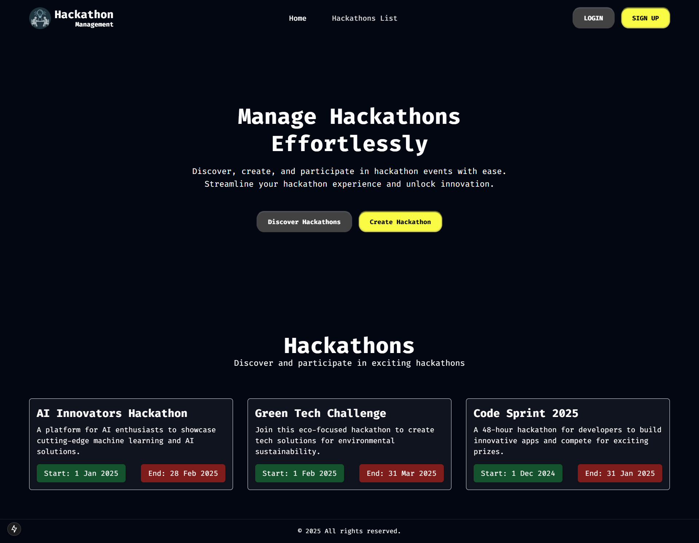
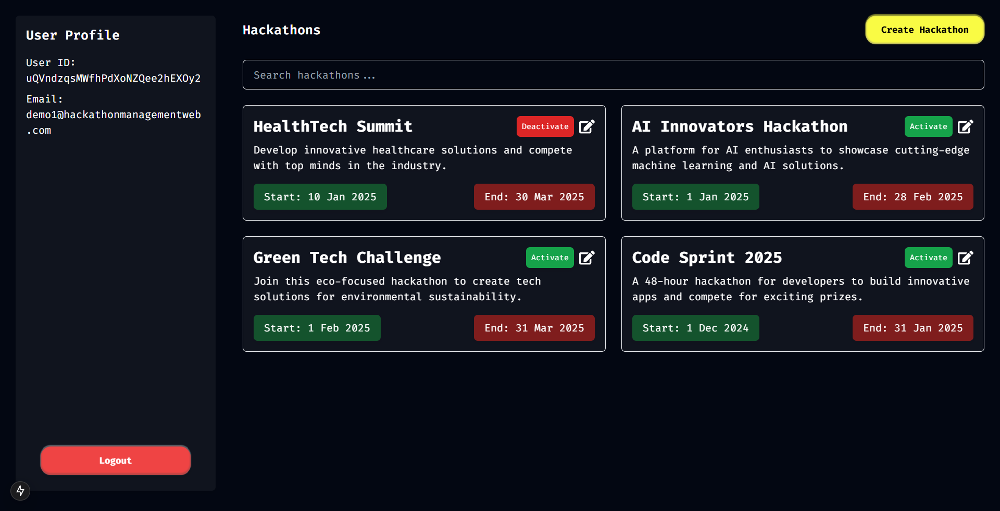

# Hackathon Management Web

This is a **Hackathon Management Web Application** built using modern web technologies like **Next.js**, **TypeScript**, and **Tailwind CSS**. The project provides features for managing in hackathons, such as user authentication, dashboard views, and hackathon creation tools.

---

## 🚀 Features

- **User Authentication:** Login and Signup pages.
- **Hackathon Management:** Create, edit, and view hackathons.
- **Responsive Design:** Built with Tailwind CSS for a seamless experience on all devices.
- **Reusable Components:** Structured for scalability and maintainability.

---

## 📂 Directory Structure

```
.
└── hackathon-management-web/
    ├── public/
    │   └── images/
    ├── src/
    │   ├── app/
    │   │   ├── dashboard/
    │   │   │   └── page.tsx
    │   │   ├── fonts/
    │   │   │   └── index.ts
    │   │   ├── login/
    │   │   │   └── page.tsx
    │   │   ├── signup/
    │   │   │   └── page.tsx
    │   │   ├── globals.css
    │   │   ├── layout.tsx
    │   │   ├── loading.tsx
    │   │   ├── not-found.tsx
    │   │   ├── page.tsx
    │   ├── components/
    │   │   ├── common/
    │   │   │   ├── Footer.tsx
    │   │   │   └── Header.tsx
    │   │   ├── dashboard/
    │   │   │   ├── CreateHackathonModal.tsx
    │   │   │   └── UserProfile.tsx
    │   │   ├── home/
    │   │   │   ├── HackathonList.tsx
    │   │   │   └── Hero.tsx
    │   │   ├── ui/
    │   │   │   ├── Button.tsx
    │   │   │   └── Input.tsx
    │   │   └── wrappers/
    │   │       ├── Container.tsx
    │   │       └── Layout.tsx
    │   ├── data/
    │   │   └── data.json
    │   ├── hooks/
    │   │   └── useAuth.ts
    │   ├── lib/
    │   │   └── firebase.ts
    │   ├── types/
    │   │   └── index.ts
    │   └──utils/
    │       └── dateUtils.ts
    ├── README.md
    ├── eslint.config.mjs
    ├── next.config.ts
    ├── package.json
    ├── postcss.config.mjs
    ├── tailwind.config.ts
    ├── tsconfig.json
```

---

## 🛠️ Technologies Used

- **Next.js**: React framework for building fast and scalable web applications.
- **TypeScript**: Type-safe programming.
- **Tailwind CSS**: Utility-first CSS framework.
- **Firebase**: For authentication and backend services.

---

## 🔧 Setup Instructions

1. Clone the repository:

   ```bash
   git clone https://github.com/amankashyap004/hackathon-management-web.git
   ```

2. Navigate to the project directory:

   ```bash
   cd hackathon-management-web
   ```

3. Install dependencies:

   ```bash
   npm install
   ```

4. Start the development server:

   ```bash
   npm run dev
   ```

5. Open the app in your browser:

   ```
   http://localhost:3000
   ```

---

## 🌐 Links

[Hackathon Management Web Repository](https://github.com/amankashyap004/hackathon-management-web.git)

[Hackathon Management Web Live](https://hackathon-management-web.vercel.app/)


---

## 📸 Screenshots

### Home Page



### Dashboard



---


## 🤝 Contributing

Contributions are welcome! Please fork the repository and submit a pull request.

---

## 🙋 Support

If you encounter any issues, feel free to open an issue in the repository or contact me directly through GitHub.
